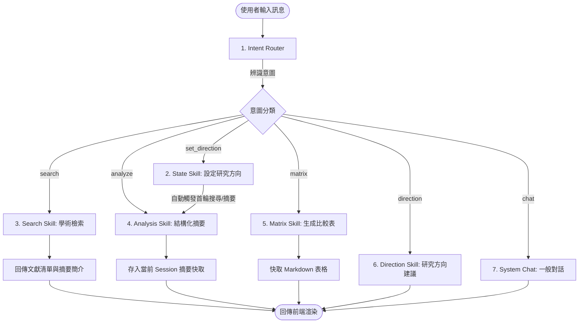

# 🔬 AI 研究助理 Agent 工作流設計 (Agent Workflows Guide)

本文件定義了兩大工作流：
1. **執行期 Agent 業務工作流 (Runtime Agent Workflow)**：本系統內部的 AI 助理如何協同處理使用者的學術請求。
2. **開發期 Agent 任務工作流 (Developer Agent Implementation Workflow)**：接手本專案的 Coding Agent 應如何循序漸進地修復 [問題.md](file:///c:/Users/User/Downloads/1/ai-final/%E5%95%8F%E9%A1%8C.md) 的已知問題並進行驗證。

---

## 🔄 1. 執行期 Agent 業務工作流 (Runtime Workflow)

當使用者在前端發送請求或上傳文件時，系統內部的 `AgentCore` 與各個 `Skill` 模組依循以下流程運行：

### 流程 A：使用者學術對話與意圖判定 (User Chat & Action Flow)

*   **關鍵程式鏈**：
    *   意圖分析：[agent_core.py](file:///c:/Users/User/Downloads/1/ai-final/backend/agent_core.py#L74) 中的 `detect_intent()` -> 調用 `self._intent_model`。
    *   狀態注入：所有技能運作時，皆會調用 [state_skill.py](file:///c:/Users/User/Downloads/1/ai-final/backend/skills/state_skill.py) 取得當前 Session 的學術上下文，確保回答不離題。

---

### 流程 B：PDF 論文上傳與 RAG 建立工作流 (PDF Upload & RAG Indexing Flow)

---

## 🛠️ 2. 開發期 Agent 任務工作流 (Developer Task Workflow)

接手本專案的 Coding Agent，建議按照以下 **五個階段** 的工作流來有序解決 [問題.md](file:///c:/Users/User/Downloads/1/ai-final/%E5%95%8F%E9%A1%8C.md) 中列出的 Bug 與功能增強需求：

### 階段一：環境修復與 PDF 上傳測試 (RAG Pipeline)
1. **目的**：解決 PDF 解析時 `MissingDependencyException` 的問題。
2. **步驟**：
   * 在終端機執行 `pip install markitdown[pdf]`，或確保 `requirements.txt` 中包含完整依賴。
   * 啟動後端，使用測試腳本或 Postman 模擬上傳一個 `.pdf` 論文檔案至 `/api/upload-paper`。
   * 檢查後端是否成功解析並切塊，且在 `./data/chroma` 產生 ChromaDB 資料。

### 階段二：強化 System Prompt 與研究角色約束 (Persona Anchor)
1. **目的**：解決「對話過程中 AI 迷失主題，須將興趣主體設定為主角人設」的問題。
2. **步驟**：
   * 前往 [agent_core.py](file:///c:/Users/User/Downloads/1/ai-final/backend/agent_core.py) 中的 `SYSTEM_PROMPT`。
   * 調整 Prompt 語意，讓模型認知自己「扮演一位專注於 `{role_context}` 領域的資深研究顧問」，在任何 `intent == "chat"` 的情況下，都要圍繞著該領域來答覆。
   * 在對話生成參數中，將 `role_context` 以 System Instruction 的方式明確帶入 `GenerativeModel`。

### 階段三：Semantic Scholar 速率限制優化 (Rate Limit Resilience)
1. **目的**：避免搜尋時頻繁出現 429 錯誤。
2. **步驟**：
   * 檢查 [search_skill.py](file:///c:/Users/User/Downloads/1/ai-final/backend/skills/search_skill.py) 中的 `search` 函式。
   * 檢查重試迴圈 `max_retries = 3`，並引入 `random jitter` 防止多線程同時重試。
   * 實作簡單的內存快取（如以 `(query, context)` 作為 Key 暫存搜尋結果 10 分鐘），避免重覆的關鍵字反覆向 API 發送請求。

### 階段四：後續建議對話問題生成 (GPT-style Follow-ups)
1. **目的**：回覆完成後，自動提供 3 個相關建議問題按鈕供使用者點選。
2. **步驟**：
   * **後端邏輯**：在 [agent_core.py](file:///c:/Users/User/Downloads/1/ai-final/backend/agent_core.py#L85) 的對話回傳格式中，新增 `"suggestions": list[str]` 欄位。呼叫 Gemini 生成 3 個適合後續追問的研究主題或問題。
   * **前端整合**：修改 `frontend/src/pages/ChatPage.jsx` 的訊息渲染邏輯，讀取 `suggestions` 陣列，並在最後一則訊息下方渲染為按鈕樣式。當使用者點擊按鈕時，自動將按鈕文字送出。

### 階段五：端到端整合測試與驗證 (E2E Verification)
1. **目的**：確保所有修改皆符合預期且沒有產生 Regression。
2. **步驟**：
   * 啟動前後端，於前端手動點擊「角色設定」，輸入大中小方向並儲存。
   * 驗證 Agent 是否自動搜尋文獻並存入「論文摘要」中。
   * 測試上傳 PDF 論文，確認能成功出現在摘要卡片中。
   * 選取至少 2 篇論文生成「比較矩陣」與「研究方向」，確認 Markdown 表格與推薦課題內容能正常呈現。
