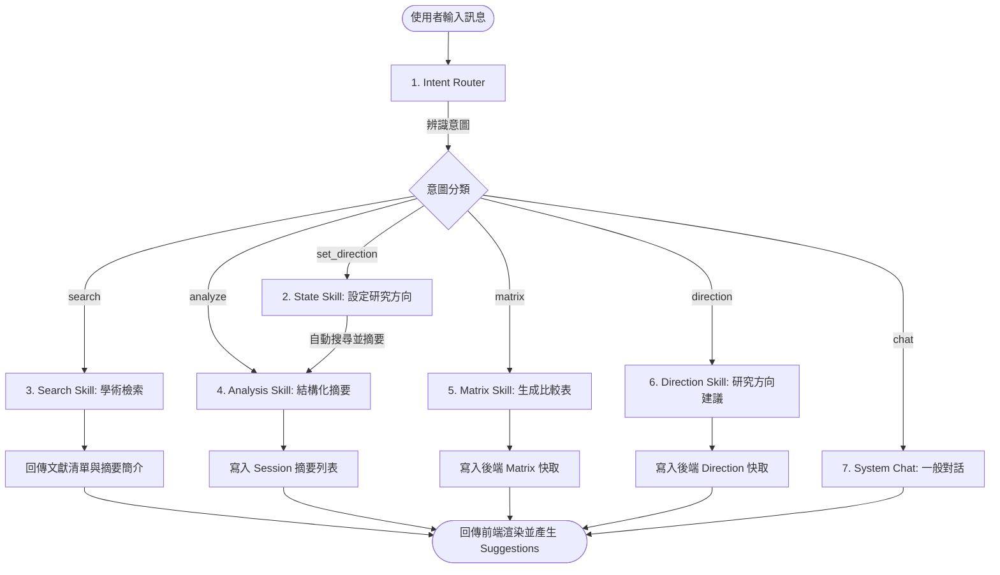
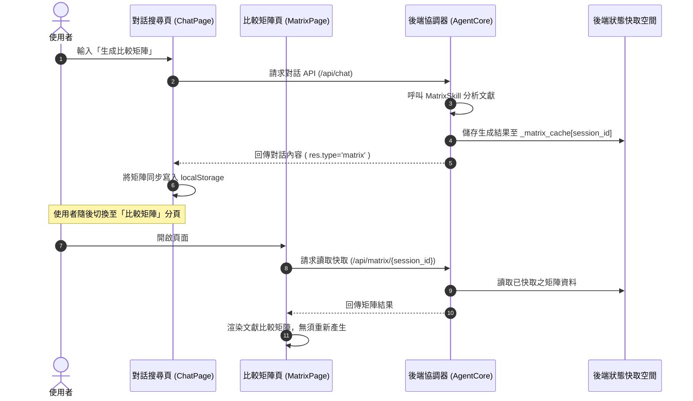

# 🔬 AI 研究助理 Agent 工作流與連動設計指南 (Agent Workflows & Sync Guide)

本文件定義並說明了本系統的兩大核心工作流架構：
1. **執行期 Agent 業務工作流 (Runtime Agent Workflow)**：系統內部各 AI 模組、快取機制與 API 接口在處理學術任務時的協同運作流程。
2. **開發期 Agent 任務工作流 (Developer Agent Implementation Workflow)**：接手本專案的開發人員（或 Coding Agent）進行功能開發、漏洞修復與整合測試的指南。

---

## 🔄 1. 執行期 Agent 業務工作流 (Runtime Workflow)

當使用者在前端發送學術請求、變更研究大綱或上傳論文時，系統藉由 `AgentCore` 及各個 `Skill` 模組透過以下幾組工作流無縫運作：

### 流程 A：使用者學術對話與意圖判定工作流 (User Chat & Intent Routing)



*   **關鍵程式鏈**：
    *   意圖判定：[agent_core.py](file:///c:/Users/User/Downloads/1/ai-final/backend/agent_core.py) 中的 `detect_intent()` 調用 Gemini 分析使用者意圖。
    *   引導建議問題：每次回答後均由 `_generate_suggestions()` 動態生成 3 個關聯的 GPT 風格追問按鈕。

---

### 流程 B：PDF 論文上傳與 RAG 向量知識庫建立工作流 (PDF Upload & RAG Pipeline)


---

### 流程 C：跨分頁狀態一致性連動工作流 (Cross-page State Synchronization)

為解決前端「對話頁」與其他獨立頁面（摘要、比較矩陣、研究方向）資料不對稱的問題，系統實作了此同步連動工作流：



*   **同步覆蓋範圍**：
    *   **論文摘要**：對話分析與 PDF 上傳所產生的摘要均存在 `self._summaries` 中，由 `SummaryPage` 透過 `/api/summaries/{session_id}` 動態載入。
    *   **比較矩陣**：對話生成的矩陣存在 `self._matrix_cache` 中，由 `MatrixPage` 透過 `/api/matrix/{session_id}` 動態載入。
    *   **研究方向**：對話生成的方向建議存在 `self._direction_cache` 中，由 `DirectionPage` 透過 `/api/direction/{session_id}` 動態載入。

---

### 流程 D：學術搜尋本地持久快取與防禦降級工作流 (Search Cache & Fallback Flow)

針對 Semantic Scholar 頻繁遭遇 429 Rate Limit (速率限制) 或超時問題，系統實作了本機快取與防禦性降級邏輯：

```mermaid
flowchart TD
    Query[搜尋關鍵字與研究上下文] --> QueryMD5[轉換為 Cache Key]
    QueryMD5 --> CheckCache{本地快取是否有記錄?}
    CheckCache -->|有| ReturnCache[直接回傳本地快取文獻]
    CheckCache -->|無| APIRequest[向 Semantic Scholar API 發送請求]
    APIRequest --> ResponseCheck{請求是否成功 (200)?}
    ResponseCheck -->|成功| SaveCache[存入本地 search_cache.json] --> ReturnCache
    ResponseCheck -->|失敗 (429/超時)| Retry{還有重試次數?}
    Retry -->|有| Backoff[指數退避延遲 1s -> 2s -> 4s] --> APIRequest
    Retry -->|無| Fallback[模糊比對降級：在本地快取模糊檢索相似文獻]
    Fallback --> FallbackCheck{是否有相似文獻?}
    FallbackCheck -->|有| ReturnCache
    FallbackCheck -->|無| RaiseError[拋出斷網/API 失效異常]
```

---

## 🛠️ 2. 開發與維護工作流 (Developer Task Workflow)

接手本專案的 Coding Agent，應按照以下規範的工作流程進行日常的維護、偵錯與擴充：

### 階段一：依賴與環境就緒驗證 (Prerequisites)
1. 在 Python 虛擬環境中確實安裝必要套件：
   ```powershell
   pip install -r requirements.txt
   pip install markitdown[pdf]
   ```
2. 確認 `backend/.env` 與 `frontend/.env` 配置正確，尤其是 `GEMINI_API_KEY` 與 `SEMANTIC_SCHOLAR_API_KEY`。

### 階段二：錯誤處理與防禦性程式開發 (Defensive Coding)
1. **API Key 403 失效**：所有 LLM 調用鏈必須以 `try...except google.api_core.exceptions.Forbidden` 包裹，回傳友善錯誤提示引導更換 API Key，嚴防系統崩潰。
2. **PDF 依賴缺失**：呼叫 `parse_pdf_to_markdown` 時需專門捕獲 `MissingDependencyException`，以便精確提示使用者安裝 `markitdown[pdf]`。

### 階段三：跨分頁整合測試流程 (E2E Verification Checklist)
在進行任何功能修改或代碼提交前，必須依照以下步驟進行完整測試：
1. **啟動測試環境**：
   * 後端：`cd backend` -> `.\venv\Scripts\python main.py` (確認連通 `http://localhost:8000`)
   * 前端：`cd frontend` -> `cmd /c npm run dev` (確認造訪 `http://localhost:5173`)
2. **工作流 A & B 測試**：
   * 前往對話頁面，點選並設定「大、中、小研究方向」。
   * 檢查設定完成後，Agent 是否自動搜尋並分析了 2 篇論文，且這些論文已成功出現在「論文摘要」記錄頁中。
3. **工作流 C 測試 (跨頁連動)**：
   * 在對話頁輸入「生成比較矩陣」並等待產出。
   * 切換至「比較矩陣」分頁，確認無需再次點擊按鈕，頁面上就已正確呈現與剛才對話一致的比較表格。
   * 在對話頁點擊建議追問中的「分析研究方向」，隨後前往「研究方向」分頁，驗證報告已同步顯示。
4. **工作流 D 測試 (防禦性快取)**：
   * 斷開外網，或短時間內發送大量搜尋請求。
   * 檢查 `backend/data/search_cache.json` 是否生成，並且系統是否正常回傳快取文獻，而非拋出 HTTP 429 崩潰。

### 階段四：強制工作進度記錄規範 (Mandatory Progress Logging & Handoff Standard)
為了確保後續的 Coding Agent 能夠無縫接手開發，**所有參與本專案開發與修復任務的 AI Agent 必須在每次任務結束前完成以下記錄工作**：
1. **更新開發日誌 (`開發日誌.md`)**：
   * 每次修改程式碼或設定後，必須在 [開發日誌.md](file:///c:/Users/User/Downloads/1/ai-final/%E9%96%8B%E7%99%BC%E6%97%A5%E8%AA%8C.md) 中新增或更新對應週別的記錄。
   * 明確記錄：修改的檔案路徑、修改的核心邏輯、新增的依賴套件、已解決的 Bug 以及任何關鍵技術決策（ADR）。
2. **記錄待辦與下一步**：
   * 在 [開發日誌.md](file:///c:/Users/User/Downloads/1/ai-final/%E9%96%8B%E7%99%BC%E6%97%A5%E8%AA%8C.md) 的「待辦與下一步」區塊中，勾選已完成的任務，並列出當前中斷或未完成的高/中/低優先級事項，供下一位 Agent 快速識別現狀。
3. **維護人設與約束設定**：
   * 若有調整核心模型（如強制使用 `gemma-4-26b-a4b-it`）或主要人設提示詞，必須確保 `.env`、`MODELS.md` 以及說明文件同步更新，並在開發日誌中予以警告，防止後續 Agent 誤改設定。
