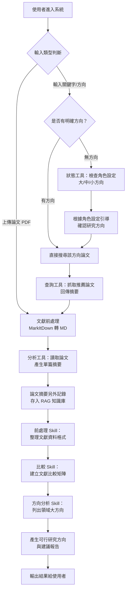
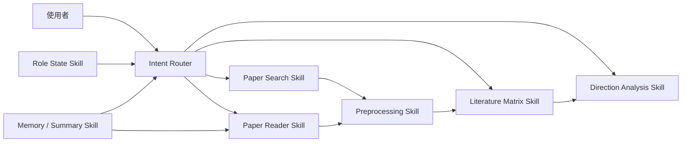

# 期末專題主題提案報告 — AI 研究助理 Agent

---

# 1. 專題名稱與一句話說明

| 專題名稱              | 一句話說明                                                                                                       |
| --------------------- | ---------------------------------------------------------------------------------------------------------------- |
| AI 研究助理 Agent     | 協助使用者透過關鍵字搜尋論文、上傳文獻進行摘要與比較、建立文獻比較矩陣，並根據角色設定自動分析研究領域方向與建議的 AI 研究輔助系統 |

---

# 2. 目標使用者與痛點

| 項目                | 說明                                                                                                             |
| ------------------- | ---------------------------------------------------------------------------------------------------------------- |
| 目標使用者          | 碩博士研究生、大學專題生、研究人員，需要進行文獻回顧與研究方向探索的使用者                                        |
| 使用情境            | 1. 剛進入新研究領域，不知道從何開始閱讀文獻 2. 需要整理大量論文並進行系統性比較 3. 想找出研究 gap 並產生可行的研究方向 |
| 痛點                | 1. 論文數量龐大，手動閱讀與整理耗時費力 2. 不知道自己的研究領域有哪些大方向與子方向 3. 文獻比較矩陣需手動建立，格式不一致且容易遺漏 4. 初學者不知如何從文獻中歸納出可行的研究問題 |
| 為什麼需要 AI Agent | 因為系統需要根據使用者的角色設定（大方向 / 中方向 / 小方向）動態判斷搜尋範圍，並依據上傳的論文內容進行多步驟處理（前處理 → 摘要 → 比較 → 生成建議），無法用固定流程或簡單查詢完成 |

---

# 3. 核心任務流程

## Q1. 使用者會輸入什麼

使用者輸入分為兩種模式：

### 模式一：有方向（進入二分法）
1. **輸入論文大方向**：例如「SiC」、「光電」、「機器學習」等關鍵字或領域描述
2. **不知道方向**：系統根據使用者的角色設定（預設研究領域）自動引導查詢

### 模式二：直接丟論文（不需二分法）
1. **上傳論文檔案**（PDF），系統直接進行讀取、摘要與分析

## Q2. Agent 先判斷什麼

```text
1. 判斷使用者是否已有研究方向
   ├── 有方向 → 直接查詢該方向的相關論文
   └── 無方向 → 根據角色設定（大 / 中 / 小方向）引導使用者確認方向
2. 判斷輸入類型
   ├── 關鍵字 / 文字描述 → 呼叫查詢工具搜尋論文
   └── 上傳論文檔案 → 呼叫分析工具進行前處理與摘要
3. 判斷角色設定的方向層級
   ├── 大方向（例如：光電）
   ├── 中方向（例如：太陽能電池）
   └── 小方向（例如：鈣鈦礦）
   → 依層級縮小搜尋範圍
```

## Q3. Agent 會呼叫哪些工具

| 工具       | 功能                                                         |
| ---------- | ------------------------------------------------------------ |
| 分析工具   | 讀取上傳的論文，使用 MarkItDown 將文獻轉成 MD 檔進行前處理    |
| 查詢工具   | 根據方向或關鍵字抓取推薦論文，回傳摘要與基本資訊              |
| 狀態工具   | 判斷角色設定中是否已有大 / 中 / 小方向，動態縮小搜尋範圍      |

## Q4. 狀態會如何改變

```text
初始狀態：使用者角色設定（可能有或無方向）
├── 有方向 → 狀態標記為「已確認方向」→ 直接進入搜尋流程
└── 無方向 → 根據角色設定推薦方向 → 使用者確認後 → 狀態變為「已確認方向」
→ 搜尋論文 → 狀態更新為「已取得文獻」
→ 分析比較 → 狀態更新為「已完成分析」
→ 產出建議 → 狀態更新為「已產出報告」
```

## 流程圖



---

# 4. Agent 架構設計

本系統採用多 Skill 單 Agent 架構，由一個主控 Agent 根據使用者意圖調度不同的 Skill 模組。

## Agent / Skill 模組表

| 模組 / Skill             | 任務                                           | 輸入                          | 輸出                                 |
| ------------------------ | ---------------------------------------------- | ----------------------------- | ------------------------------------ |
| Intent Router            | 判斷使用者意圖（搜尋 / 上傳 / 比較 / 建議）    | 使用者訊息                    | 任務類型與參數                        |
| Paper Search Skill       | 根據關鍵字搜尋論文並回傳摘要                    | 關鍵字、方向、角色設定         | 論文清單與摘要                        |
| Paper Reader Skill       | 讀取上傳的論文並產生結構化摘要                   | 論文 PDF / MD 檔              | 結構化摘要（目的、方法、結果、限制）   |
| Preprocessing Skill      | 對文獻做前處理（MarkItDown 轉 MD、欄位提取）    | 原始論文檔案                   | 標準化 MD 格式文獻資料                |
| Literature Matrix Skill  | 建立文獻比較矩陣                                | 多篇已前處理的文獻資料         | 文獻比較矩陣表格                      |
| Direction Analysis Skill | 根據文獻分析該領域所有大方向，生成研究方向建議   | 文獻比較矩陣 + 摘要資料        | 研究方向清單與可行性建議               |
| Role State Skill         | 管理使用者角色設定與方向狀態                    | 使用者設定 / 對話歷史          | 大 / 中 / 小方向狀態                  |
| Memory / Summary Skill   | 記錄論文摘要與對話歷史                          | 摘要、對話紀錄                 | 持久化的摘要紀錄與上下文               |

## 架構圖



---

# 5. RAG / 資料來源設計

| 項目         | 說明                                                                                                             |
| ------------ | ---------------------------------------------------------------------------------------------------------------- |
| 資料來源     | 1. 使用者上傳的論文 PDF 2. 透過學術搜尋 API（如 Semantic Scholar、arXiv API）抓取的論文資料 3. 對話中產生的摘要紀錄 |
| 資料格式     | 論文原始格式為 PDF，使用 **MarkItDown** 工具轉換為 Markdown 格式後儲存；摘要與比較矩陣以 Markdown / JSON 格式儲存  |
| 資料建立方式 | 1. 使用者主動上傳論文 2. 系統透過 API 自動抓取相關論文摘要 3. Agent 分析後自動產生的結構化資料                      |
| 查詢方式     | 1. 關鍵字搜尋（學術 API 查詢） 2. 語意檢索（基於 embedding 的向量搜尋，用於已上傳的文獻庫） 3. 結構化查詢（比較矩陣欄位篩選） |
| 使用時機     | 1. 使用者輸入關鍵字搜尋時 → 查詢外部學術 API 2. 建立比較矩陣時 → 查詢已上傳的文獻 RAG 知識庫 3. 產生研究方向時 → 查詢所有文獻摘要與比較結果 |
| 來源標示     | 所有回答均標示論文來源（標題、作者、年份、DOI），比較矩陣中每個欄位可追溯至原始論文段落                             |

## RAG 流程

```text
使用者上傳 PDF
    → MarkItDown 轉為 MD 檔
    → 切分文檔段落（Chunking）
    → 產生 Embedding 向量
    → 存入向量資料庫（如 ChromaDB / FAISS）
    → Agent 查詢時進行語意檢索
    → 將檢索結果作為 Context 送入 LLM 產生回答
```

---

# 6. Tool Calling 設計

## 工具表

| 工具名稱                  | 功能                                                       | 輸入                                | 輸出                                         | 觸發時機                                 |
| ------------------------- | ---------------------------------------------------------- | ----------------------------------- | -------------------------------------------- | ---------------------------------------- |
| `search_papers`           | 根據關鍵字或方向搜尋學術論文                                | 關鍵字、領域、年份範圍               | 論文清單（標題、作者、摘要、DOI）             | 使用者輸入搜尋關鍵字或系統需要補充文獻時  |
| `parse_paper`             | 使用 MarkItDown 將上傳的論文 PDF 轉為 MD 並提取結構化內容   | 論文 PDF 檔案路徑                    | Markdown 格式的論文內容                       | 使用者上傳論文時                          |
| `summarize_paper`         | 對單篇論文產生結構化摘要                                    | 論文 MD 內容                         | 結構化摘要（目的、方法、結果、結論、限制）     | 論文解析完成後自動觸發                    |
| `build_literature_matrix` | 將多篇論文的摘要整合為文獻比較矩陣                          | 多篇論文的結構化摘要                 | 比較矩陣表格（Markdown 格式）                 | 使用者要求比較或累積足夠論文數量時        |
| `analyze_directions`      | 根據文獻比較矩陣分析領域大方向並產生研究建議                 | 文獻比較矩陣 + 角色設定              | 研究方向清單、可行性分析、建議報告             | 使用者要求分析方向或完成文獻矩陣後        |
| `check_role_state`        | 檢查使用者角色設定中的大 / 中 / 小方向，決定搜尋範圍         | 使用者角色設定資料                   | 目前方向層級與建議搜尋範圍                     | 使用者首次輸入或方向不明確時              |
| `save_summary`            | 將論文摘要另外記錄並存入知識庫                               | 論文摘要、metadata                  | 儲存確認與索引 ID                              | 每次產生摘要後自動觸發                    |

---

# 7. 預期畫面與操作方式

## 畫面規劃

| 畫面                  | 內容                                                                                             |
| --------------------- | ------------------------------------------------------------------------------------------------ |
| 首頁 / 角色設定頁      | 使用者設定研究角色（大 / 中 / 小方向），建立個人化的研究 profile；可新增對話視窗                    |
| 對話互動頁            | 主要操作介面，支援多對話視窗。使用者可輸入關鍵字搜尋論文、上傳論文 PDF、要求摘要或比較              |
| 論文摘要記錄頁         | 獨立頁面，記錄所有已分析論文的摘要，可搜尋、篩選、匯出                                            |
| 文獻比較矩陣頁         | 以表格形式顯示多篇論文的比較矩陣，支援排序與篩選                                                  |
| 研究方向建議報告頁     | 顯示 Agent 分析後產出的研究方向清單、可行性評估與建議，可匯出為 Markdown                           |

## 畫面草圖說明

### 畫面一：對話互動頁（主頁面）

```text
┌─────────────────────────────────────────────────────────────┐
│  🔬 AI 研究助理                          [+ 新增對話] [⚙️]  │
├──────────┬──────────────────────────────────────────────────┤
│ 對話列表  │                對話區域                          │
│          │                                                  │
│ ● 對話 1  │  🤖 您好！請問您想搜尋哪個領域的論文？            │
│ ● 對話 2  │     或者您可以直接上傳論文進行分析。              │
│ ● 對話 3  │                                                  │
│          │  👤 我想搜尋 SiC 相關的論文                       │
│          │                                                  │
│          │  🤖 已搜尋到 15 篇相關論文，以下為推薦摘要...     │
│          │     📄 論文 1: ...                                │
│          │     📄 論文 2: ...                                │
│          │                                                  │
│          ├──────────────────────────────────────────────────┤
│          │  [📎 上傳論文]  [輸入訊息...]          [送出 ➤]  │
└──────────┴──────────────────────────────────────────────────┘
```

### 畫面二：論文摘要記錄頁

```text
┌─────────────────────────────────────────────────────────────┐
│  📋 論文摘要紀錄                    [搜尋 🔍] [匯出 📥]     │
├─────────────────────────────────────────────────────────────┤
│                                                             │
│  📄 論文標題：A Review of SiC Power Devices                │
│  👤 作者：Wang et al., 2024                                │
│  🎯 研究目的：探討 SiC 功率元件的最新發展...                │
│  🔬 研究方法：系統性文獻回顧...                             │
│  📊 主要結果：SiC MOSFET 效能提升 30%...                   │
│  ⚠️ 研究限制：僅考慮 2020 年後的文獻...                    │
│  ─────────────────────────────────────────────────────────  │
│  📄 論文標題：Perovskite Solar Cells...                    │
│  ...                                                        │
└─────────────────────────────────────────────────────────────┘
```

### 畫面三：文獻比較矩陣頁

```text
┌─────────────────────────────────────────────────────────────┐
│  📊 文獻比較矩陣                          [匯出 Markdown]   │
├──────────┬──────────┬──────────┬──────────┬─────────────────┤
│ 論文      │ 研究方法  │ 資料來源  │ 主要發現  │ 研究限制       │
├──────────┼──────────┼──────────┼──────────┼─────────────────┤
│ Wang2024 │ 文獻回顧  │ IEEE/Scopus│ SiC效能↑ │ 時間範圍有限   │
│ Li2023   │ 實驗分析  │ 自行量測  │ 新結構   │ 樣本數不足     │
│ Chen2024 │ 模擬分析  │ TCAD     │ 最佳化   │ 未經實驗驗證   │
├──────────┴──────────┴──────────┴──────────┴─────────────────┤
│  🔍 研究 Gap 分析：                                         │
│  1. 缺乏大規模量產可行性評估                                 │
│  2. 高溫環境下的長期可靠度數據不足                            │
│  3. ...                                                      │
└─────────────────────────────────────────────────────────────┘
```

---

# 8. 期末 Demo 情境設計

## Demo 情境

### 情境一：關鍵字搜尋與論文摘要

```text
步驟 1：使用者設定角色為「光電領域 → 太陽能電池 → 鈣鈦礦」
步驟 2：使用者輸入「perovskite solar cell efficiency 2024」
步驟 3：Agent 呼叫 check_role_state → 確認小方向為鈣鈦礦，縮小搜尋範圍
步驟 4：Agent 呼叫 search_papers → 回傳 10 篇推薦論文與摘要
步驟 5：使用者選擇 3 篇論文，Agent 呼叫 save_summary 記錄摘要
步驟 6：摘要紀錄頁即時更新
```

### 情境二：上傳論文並建立比較矩陣

```text
步驟 1：使用者上傳 5 篇 PDF 論文
步驟 2：Agent 呼叫 parse_paper → 使用 MarkItDown 將每篇轉為 MD
步驟 3：Agent 呼叫 summarize_paper → 產生 5 篇結構化摘要
步驟 4：Agent 呼叫 build_literature_matrix → 產出文獻比較矩陣
步驟 5：比較矩陣頁顯示表格，使用者可排序篩選
```

### 情境三：研究方向分析與建議

```text
步驟 1：使用者要求「根據這些論文，幫我找出可行的研究方向」
步驟 2：Agent 呼叫 analyze_directions → 讀取比較矩陣與所有摘要
步驟 3：Agent 產出該領域所有大方向清單
步驟 4：Agent 標記研究 Gap 並產生 3-5 個可行研究方向建議
步驟 5：研究方向建議報告頁顯示結果，可匯出 Markdown
```

### 情境四：無方向使用者的引導流程

```text
步驟 1：新使用者進入系統，尚未設定研究方向
步驟 2：使用者輸入「我不知道要研究什麼」
步驟 3：Agent 呼叫 check_role_state → 偵測無方向
步驟 4：Agent 根據角色設定引導：「您的背景是光電領域，建議可以從以下方向開始...」
步驟 5：使用者選擇「太陽能電池」→ 狀態更新為中方向
步驟 6：Agent 進一步引導確認小方向 → 開始搜尋相關論文
```

## 觀眾可看到的展示效果

1. **即時對話互動**：使用者輸入後 Agent 即時回應與工具呼叫過程
2. **論文摘要自動記錄**：摘要頁面即時更新，展示結構化的摘要卡片
3. **文獻比較矩陣動態生成**：從零到完成比較矩陣的過程
4. **研究方向視覺化報告**：展示大方向 → 子方向的樹狀結構與建議
5. **多對話視窗**：展示同時開啟多個研究主題的對話

---

# 9. 組員分工

| 成員 | 負責內容                                                         |
| ---- | ---------------------------------------------------------------- |
| A    | 前端 UI 開發（Web App 介面、對話視窗、摘要記錄頁、比較矩陣頁）    |
| B    | 後端 API 設計、資料庫設計、使用者角色設定與狀態管理                |
| C    | Agent 流程設計、Prompt Engineering、Tool Calling 串接             |
| D    | RAG 系統建置、MarkItDown 文獻前處理、向量資料庫管理               |

---

# 10. 評估方式

## 評估面向

| 評估面向         | 說明                                                       |
| ---------------- | ---------------------------------------------------------- |
| 任務完成率       | Agent 是否能完成搜尋、摘要、比較、方向建議等核心任務        |
| 回答正確性       | 摘要是否忠實反映論文內容，比較矩陣是否準確                  |
| 工具呼叫正確性   | 是否在正確時機呼叫正確工具（搜尋 vs 分析 vs 比較）          |
| 記憶一致性       | 是否記得使用者角色設定、已上傳論文與方向狀態                |
| 使用體驗         | 對話是否流暢、多視窗操作是否直覺、摘要記錄是否易於查閱      |
| 失敗處理         | 論文解析失敗、搜尋無結果時是否能給出合理提示與替代方案       |
| 展示穩定度       | Demo 全程是否能順利完成四個情境                              |

## 測試案例

| 測試案例                         | 預期結果                                                   |
| -------------------------------- | ---------------------------------------------------------- |
| 輸入明確關鍵字（如 SiC）         | Agent 搜尋並回傳相關論文清單與摘要                           |
| 輸入「我不知道要研究什麼」        | Agent 根據角色設定引導使用者確認方向                         |
| 上傳一篇 PDF 論文                | Agent 成功轉為 MD 並產生結構化摘要，摘要記錄頁自動更新       |
| 上傳 5 篇論文後要求比較           | Agent 產出完整的文獻比較矩陣                                |
| 要求分析研究方向                  | Agent 列出領域大方向並產生 3-5 個可行研究建議                |
| 上傳非論文檔案（如圖片）          | Agent 提示檔案格式不支援，建議上傳 PDF                      |
| 切換對話視窗                      | 不同對話的上下文與狀態獨立，不互相干擾                      |
| 角色設定為空的新使用者            | Agent 能正確進入引導流程，不會直接報錯                       |
