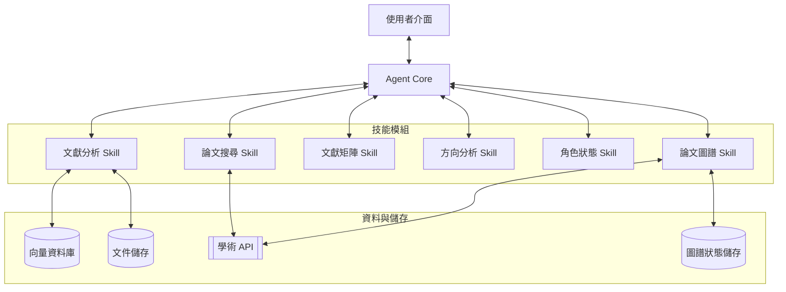
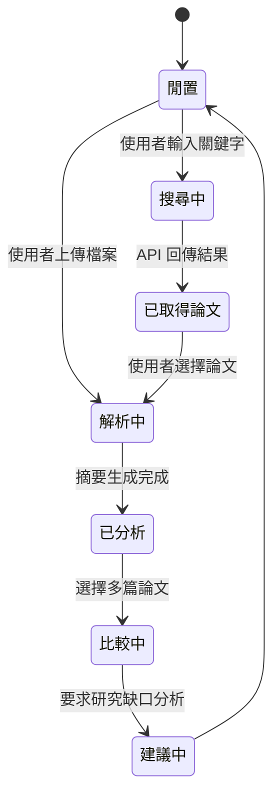

# 系統架構總覽：AI 研究助理 Agent

本文件提供 AI 研究助理系統的高階架構概覽、組件關係與資料流向說明。

## 1. 高階架構

系統採用**多技能單一 Agent（Multi-Skill Single Agent）**設計。此設計確保系統有一個集中式的「大腦」（Agent Core），同時為各自獨立的任務維護專屬的技能模組。

## 2. 組件說明

### 2.1 Agent Core（協調器）
系統的核心協調器，負責：
- **意圖解析**：判斷使用者是要搜尋、分析，還是進行比較。
- **工作流程管理**：依序呼叫各技能（例如：搜尋 → 分析 → 矩陣）。
- **最終輸出生成**：將各技能的原始輸出整合為使用者友善的回應。

### 2.2 技能模組（Skill Modules）
- **論文搜尋 Skill**：使用 `search_papers` 工具查詢外部學術來源。
- **文獻分析 Skill**：透過 **MarkItDown** 處理 PDF 轉 Markdown，並將資料存入 RAG 知識庫。
- **文獻矩陣 Skill**：將結構化資料彙整為比較表格。
- **方向分析 Skill**：跨多份文件進行語意缺口分析，建議新的研究方向。
- **角色狀態 Skill**：管理使用者的研究角色（大方向 / 中方向 / 小方向）。
- **論文圖譜 Skill**：建立論文引用連結圖（Knowledge Graph），支援節點展開（Hop Expansion）、Louvain 社群偵測與 Gemini 圖譜報告生成。使用 **NetworkX** 計算圖指標，前端以 **react-force-graph** 渲染圖形。

### 2.3 RAG（檢索增強生成）管道
RAG 管道是確保分析準確性的關鍵：
1. **解析**：MarkItDown 從 PDF 中提取文字、表格與參考文獻。
2. **索引**：文件被切分後儲存至向量資料庫（如 ChromaDB/FAISS）。
3. **檢索**：在分析與比較階段，擷取相關上下文以為 LLM 的回應提供依據。

## 3. 技術棧
- **LLM**：Gemini 2.5 Flash。
- **文件解析**：MarkItDown。
- **搜尋 API**：Semantic Scholar、arXiv API。
- **向量儲存**：ChromaDB / FAISS。
- **前端**：Vite + React。
- **後端**：FastAPI。

## 4. 狀態轉換圖

