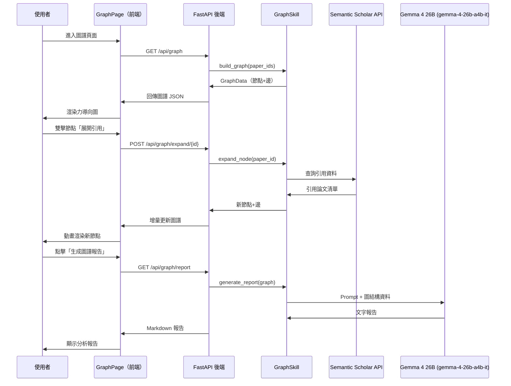

# 功能規格：論文圖譜（Paper Knowledge Graph）

> 文件版本：v1.0  
> 建立日期：2026-05-13  
> 關聯模組：`graph_skill.py`、`GraphPage.jsx`  

---

## 1. 功能概述

**論文圖譜（Paper Knowledge Graph）** 是一套以互動式視覺化圖形呈現論文間關聯性的功能模組。使用者可直觀地探索引用關係、作者網絡、研究主題群集，以及論文在知識體系中的相對位置，從而快速識別核心論文、研究脈絡與潛在合作機會。

### 核心價值主張
| 痛點 | 解決方案 |
|------|---------|
| 無法快速掌握領域內的「關鍵論文」 | 以節點大小/顏色標示引用數與影響力 |
| 不清楚論文之間的脈絡與演進 | 以有向邊（Directed Edge）呈現引用關係 |
| 難以發現主題聚落或研究社群 | 以社群偵測演算法自動群集相似論文 |
| 文獻回顧缺乏系統性 | 圖譜探索模式，沿引用鏈遍歷相關文獻 |

---

## 2. 圖譜資料模型

### 2.1 節點（Node）

```json
{
  "id": "paper_id",
  "label": "論文標題（縮短版）",
  "type": "paper",
  "metadata": {
    "title": "完整論文標題",
    "authors": ["作者 A", "作者 B"],
    "year": 2023,
    "doi": "10.xxxx/xxxxx",
    "url": "https://...",
    "abstract_summary": "AI 生成的單句摘要",
    "citation_count": 142,
    "topic_cluster": "transformer_architecture",
    "in_knowledge_base": true
  }
}
```

**節點類型（`type` 欄位）**

| 類型 | 說明 | 視覺呈現 |
|------|------|---------|
| `paper` | 一般論文 | 圓形節點，藍色系 |
| `survey` | 綜述論文 | 六角形節點，紫色 |
| `anchor` | 使用者加入知識庫的論文 | 圓形節點，金色外框 |
| `author_hub` | 作者群集節點（作者視圖模式） | 菱形節點，橘色 |

### 2.2 邊（Edge）

```json
{
  "id": "edge_id",
  "source": "paper_id_A",
  "target": "paper_id_B",
  "type": "cites",
  "weight": 1,
  "metadata": {
    "context_snippet": "引用此論文的原文句子（若可取得）"
  }
}
```

**邊的類型**

| 類型 | 說明 |
|------|------|
| `cites` | A 引用 B（有向） |
| `cited_by` | A 被 B 引用（有向，反向） |
| `co_author` | 兩篇論文有共同作者（無向） |
| `semantically_similar` | AI 判斷主題高度相關（無向，語意邊） |

---

## 3. 功能需求

### 3.1 圖譜建立

| 功能 ID | 功能描述 | 觸發條件 |
|---------|---------|---------|
| KG-01 | 從知識庫中的論文自動建立初始圖譜 | 使用者進入圖譜頁面 |
| KG-02 | 從搜尋結果一鍵「加入圖譜」 | 使用者在 ChatPage 點擊「加入圖譜」 |
| KG-03 | 透過 Semantic Scholar API 自動擴展引用鏈（1-hop） | 使用者點擊節點 → 展開引用 |
| KG-04 | AI 推斷語意相似性並新增語意邊 | 背景任務，於論文加入後觸發 |

### 3.2 圖譜互動

| 功能 ID | 功能描述 |
|---------|---------|
| KG-10 | 節點拖曳（自由佈局） |
| KG-11 | 點擊節點顯示側欄詳情（摘要、作者、引用數、連結） |
| KG-12 | 雙擊節點展開 1-hop 引用鄰居 |
| KG-13 | 縮放（Zoom）與平移（Pan）操作 |
| KG-14 | 搜尋節點（高亮特定論文） |
| KG-15 | 篩選邊的類型（引用邊 / 語意邊 / 作者邊） |
| KG-16 | 切換視圖模式（引用視圖 / 作者視圖 / 主題視圖） |

### 3.3 圖譜分析（AI 輔助）

| 功能 ID | 功能描述 | 使用的 AI 能力 |
|---------|---------|--------------|
| KG-20 | 識別圖譜中的「橋梁論文」（高中介中心性） | NetworkX 圖算法 |
| KG-21 | 自動標記主題群集（社群偵測） | Louvain / Leiden 演算法 |
| KG-22 | 生成圖譜摘要報告（文字說明關鍵論文與研究脈絡） | Gemma 4 26B (gemma-4-26b-a4b-it) |
| KG-23 | 識別「知識空白區域」（孤立節點 / 未連通子圖） | 圖結構分析 |

### 3.4 匯出

| 格式 | 說明 |
|------|------|
| `JSON` | 完整節點與邊資料（用於重新匯入） |
| `PNG / SVG` | 圖譜截圖（靜態）|
| `Markdown 報告` | AI 生成的圖譜分析文字報告 |

---

## 4. 系統架構

### 4.1 後端元件

```
backend/
└── skills/
    └── graph_skill.py          # 圖譜技能主模組
backend/
└── tools/
    └── graph_engine.py         # NetworkX 圖計算引擎
    └── citation_fetcher.py     # Semantic Scholar 引用擴展工具
```

#### `graph_skill.py` 主要方法

```python
class GraphSkill(BaseSkill):

    async def build_graph(self, paper_ids: list[str]) -> GraphData:
        """從知識庫論文清單建立初始圖譜"""

    async def expand_node(self, paper_id: str, hop: int = 1) -> GraphData:
        """展開特定節點的引用鄰居（1-hop 或 2-hop）"""

    async def compute_metrics(self, graph: GraphData) -> GraphMetrics:
        """計算中心性、群集等圖指標"""

    async def generate_report(self, graph: GraphData) -> str:
        """呼叫 Gemini 生成圖譜分析報告"""

    async def detect_communities(self, graph: GraphData) -> GraphData:
        """社群偵測並標記 topic_cluster"""
```

#### 新增 API 端點（`main.py`）

```
GET  /api/graph                       # 取得當前圖譜資料
POST /api/graph/expand/{paper_id}     # 展開特定節點
POST /api/graph/add                   # 將論文加入圖譜
GET  /api/graph/report                # 取得 AI 圖譜報告
DELETE /api/graph/node/{paper_id}     # 從圖譜移除節點
```

### 4.2 前端元件

```
frontend/src/
└── pages/
    └── GraphPage.jsx           # 圖譜主頁面
frontend/src/
└── components/
    └── PaperGraph.jsx          # 圖形渲染元件（react-force-graph）
    └── NodeDetailPanel.jsx     # 節點詳情側欄
    └── GraphToolbar.jsx        # 工具列（視圖切換、篩選、匯出）
```

#### 技術選型：`react-force-graph`
- 基於 **D3-force** 的力導向佈局（Force-Directed Layout）。
- 支援 3D / 2D 模式切換。
- 高效能節點渲染（WebGL 加速，支援千節點以上）。
- Canvas/WebGL 渲染，互動流暢。

---

## 5. 資料流程圖



---

## 6. UI 設計規格

### 頁面佈局

```
┌─────────────────────────────────────────────────────────┐
│  工具列：[引用視圖] [作者視圖] [主題視圖]  篩選▼  匯出▼  │
├──────────────────────────────┬──────────────────────────┤
│                              │  節點詳情側欄（可收合）   │
│                              │  ─────────────────────── │
│                              │  📄 論文標題              │
│    互動式圖譜畫布            │  👤 作者、年份            │
│    （Force-Directed）        │  📊 被引用次數：142       │
│                              │  🏷️  主題群集：Transformer │
│                              │  📝 AI 摘要（一句話）     │
│                              │  ─────────────────────── │
│                              │  [展開引用] [加入比較]    │
│                              │  [查看全文] [移除節點]    │
└──────────────────────────────┴──────────────────────────┘
│  圖例：● 知識庫論文  ○ 擴展論文  — 引用邊  ··· 語意邊  │
└─────────────────────────────────────────────────────────┘
```

### 節點視覺編碼

| 屬性 | 視覺映射 |
|------|---------|
| 引用數（citation_count） | 節點大小（半徑 8px ~ 32px） |
| 是否在知識庫中 | 金色外框 vs. 灰色外框 |
| 主題群集（topic_cluster） | 節點填色（每個群集一種顏色） |
| 論文年份 | 節點透明度（越新越不透明） |
| 被選中狀態 | 白色脈衝光暈動畫 |

---

## 7. 新增依賴套件

### 後端（`requirements.txt` 追加）

```
networkx>=3.3          # 圖算法（中心性、社群偵測）
python-louvain>=0.16   # Louvain 社群偵測演算法
```

### 前端（`package.json` 追加）

```json
{
  "dependencies": {
    "react-force-graph": "^1.43.0",
    "d3": "^7.9.0"
  }
}
```

---

## 8. 驗收標準（Definition of Done）

- [ ] 進入 `/graph` 頁面可正確渲染知識庫中的論文節點與引用邊
- [ ] 雙擊節點可展開 1-hop 引用，新節點有動畫加入效果
- [ ] 點擊節點可在側欄顯示完整元資料與 AI 摘要
- [ ] 社群偵測正確將相似論文上色為同一群集
- [ ] 圖譜報告（AI 生成）可在 30 秒內回傳且內容有意義
- [ ] 可匯出為 JSON 與 PNG 格式
- [ ] 在 50 個節點以下，互動流暢度不低於 30 FPS

---

## 9. 未來延伸（v2.0）

- **時間軸模式**：依論文年份動態播放引用網絡的演進。
- **學者節點**：新增作者節點，呈現作者合作網絡。
- **跨主題橋接推薦**：AI 識別可連接兩個不同研究社群的潛在論文。
- **3D 圖譜**：切換至立體空間佈局（`react-force-graph-3d`）。
