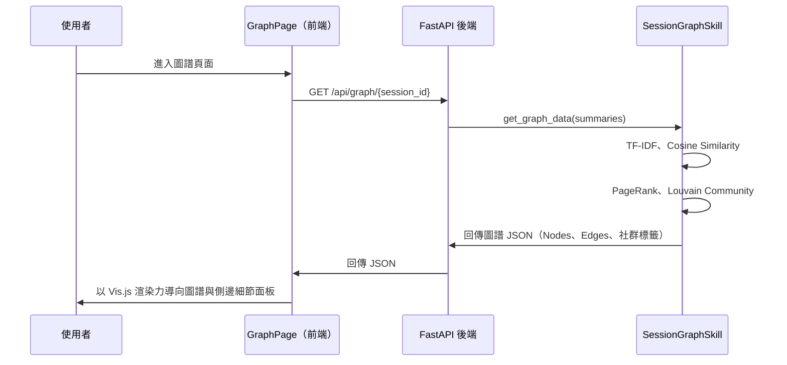

# 功能規格：論文圖譜（Paper Knowledge Graph）

> 文件版本：v1.0  
> 建立日期：2026-06-11  
> 關聯模組：`graph_skill.py`、`GraphPage.jsx`  

---

## 1. 功能概述

**論文圖譜（Paper Knowledge Graph）** 是一套以互動式視覺化圖形呈現論文間關聯性的功能模組。使用者可直觀地探索引用關係、共同研究主題群集，以及論文在知識體系中的相對位置，從而快速識別核心論文、研究脈絡與潛在合作機會。

### 核心價值主張
| 痛點 | 解決方案 |
|------|---------|
| 無法快速掌握領域內的「關鍵論文」 | 以節點大小（PageRank）標示核心論文影響力 |
| 不清楚論文之間的關聯脈絡 | 以連線粗細呈現 TF-IDF 語意相似度 |
| 難以發現主題聚落或研究社群 | 以 Louvain 社群偵測演算法自動分群相似論文並給出代表性標籤 |

---

## 2. 圖譜資料模型

### 2.1 節點（Node）

```json
{
  "id": 0,
  "label": "論文標題（縮短版）",
  "title": "完整論文標題",
  "authors": "作者列表字串",
  "year": 2024,
  "pagerank": 0.0832,
  "group": 1,
  "details": {
    "research_goal": "研究目的",
    "main_findings": "主要發現",
    "limitations": "研究限制"
  }
}
```

### 2.2 邊（Edge）

```json
{
  "from": 0,
  "to": 1,
  "weight": 0.35,
  "common_terms": ["perovskite", "efficiency", "solar"]
}
```

---

## 3. 功能需求

### 3.1 圖譜建立
- **自動相似度建模**：後端提取已分析論文的標題、摘要、研究目的與發現等文本，利用 TF-IDF 與 Cosine Similarity 計算相似度。
- **孤立節點保護**：如果某篇論文沒有高於閾值的連線，自動將其與最相似的論文相連，確保圖譜的連通性與可探索性。
- **社群與影響力計算**：利用 NetworkX 庫計算 PageRank 影響力與 Louvain 分群，並自動提取高頻學術詞語作為社群的中文/英文標籤。

### 3.2 圖譜互動
- **力導向佈局（Force-Directed Layout）**：利用 Vis.js (vis-network) 提供的力學模型進行節點分佈。
- **相似度滑動過濾**：提供 5% ~ 80% 的相似度閾值滑桿，拉高可過濾微弱關聯以消除雜訊。
- **細節檢查側欄（Sidebar Inspector）**：點選節點或連線可在側欄檢視論文摘要、 PageRank 影響力、相似度百分比與共同核心關鍵字。

---

## 4. 系統架構

### 4.1 後端元件

```
backend/
└── skills/
    └── graph_skill.py          # 論文圖譜技能主模組 (處理 TF-IDF、NetworkX 圖計算與社群偵測)
```

#### `graph_skill.py` 主要方法

```python
class SessionGraphSkill:

    def get_graph_data(self, summaries: list) -> dict:
        """計算並回傳論文知識圖譜的 Nodes、Edges 與社群代表標籤的 JSON 資料"""

    def compute_graph_metrics(self, summaries: list) -> dict:
        """計算 PageRank、Louvain 社群與 Betweenness Centrality 等圖指標以輔助方向分析"""
```

#### API 端點（`main.py`）
```
GET /api/graph/{session_id}           # 取得特定會話的完整圖譜 Nodes 與 Edges 資料
```

### 4.2 前端元件

```
frontend/src/
└── pages/
    └── GraphPage.jsx           # 圖譜主頁面（使用 vis-network 進行畫布交互與渲染）
    └── GraphPage.css           # 樣式定義與 inspectors 設計
```

---

## 5. 資料流程圖



---

## 6. 新增依賴套件

### 後端（`requirements.txt`）
```
networkx>=3.3          # 圖演算法庫
python-louvain>=0.16   # Louvain 社群偵測
scikit-learn>=1.2.0    # 相似度與特徵提取
jieba>=0.42.1          # 中文斷詞
```

### 前端（`package.json`）
```json
{
  "dependencies": {
    "vis-network": "^10.1.0"
  }
}
```

---

## 7. 驗收標準（Definition of Done）

- [x] 進入 `/graph` 頁面能正確以力學網絡渲染知識庫中的文獻。
- [x] 拖曳節點可互動分佈，縮放 (Zoom) 與平移 (Pan) 正常。
- [x] 調整相似度閾值滑桿可過濾低權重連線。
- [x] 點擊節點/邊可在右側細節檢查員面板顯示正確的論文元數據、摘要與相似度。
